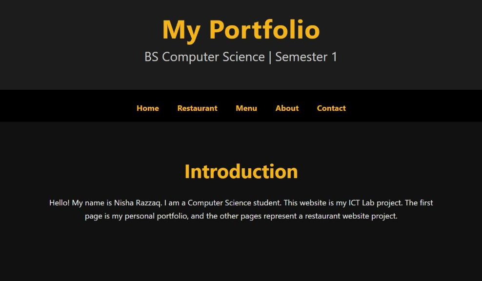
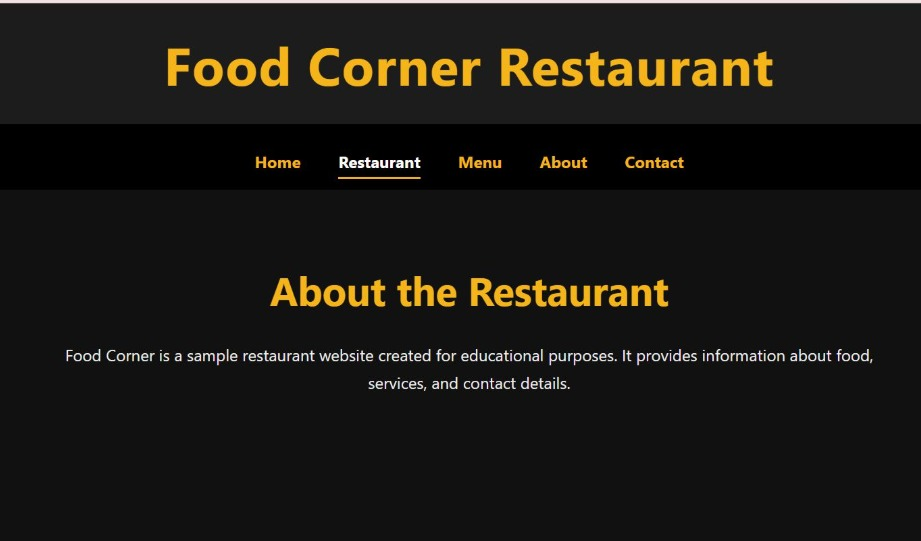
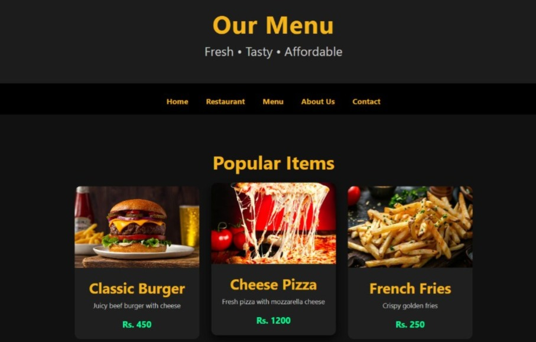
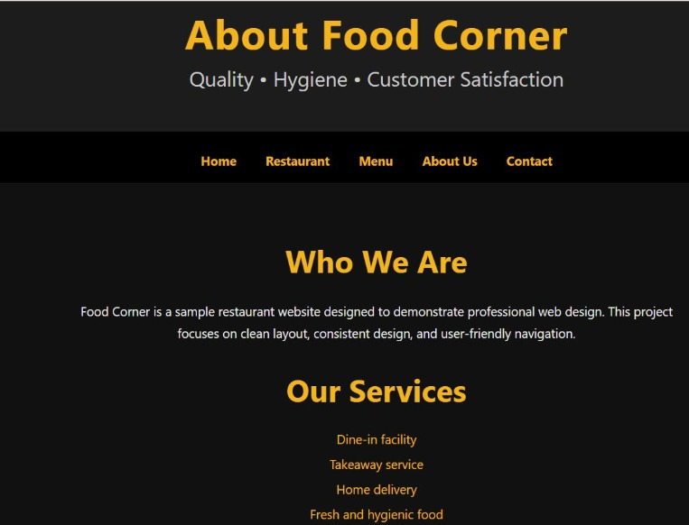
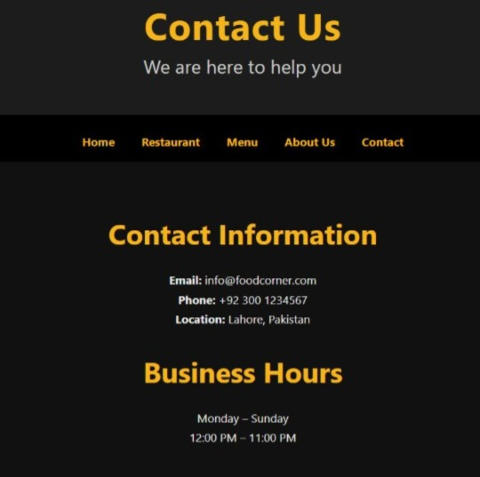

# 🍴 Restaurant Management System

A prototype restaurant management system built with **HTML** and **CSS** as part of an ICT project.  
This project demonstrates how a restaurant can manage its operations through a simple, user‑friendly interface.

---

# 📖 Overview
The Restaurant Management System simulates basic restaurant operations.  
It provides multiple pages for customers to explore the restaurant, view menus, check services, and contact staff.  
The project was created for **educational purposes** to practice front‑end development and UI design.

---

# 🛠️ Technologies
- **HTML** – for structuring the web pages  
- **CSS** – for styling and layout  
- **JPEG Images** – for food visuals (burger, pizza, fries, portfolio, services, contact)  

---

# ✨ Features
- 🏠 **Restaurant Page (restaurant.html)** – introduces the restaurant with branding and visuals  
- 👤 **About Page (about.html)** – shares background information about the restaurant  
- 🍽️ **Menu Page (menu.html)** – displays food categories, items, and prices with images  
- 🛎️ **Services Page (services.jpeg)** – highlights offerings like dine‑in, delivery, catering  
- 📞 **Contact Page (contact.html)** – provides contact details and a simple form for customer inquiries  

---

# 🔄 Process
The development of this project followed a step‑by‑step approach:
1. **Planning & Design** – sketched layout of pages and selected food images.  
2. **HTML Structure** – created semantic pages (`index.html`, `about.html`, `menu.html`, `contact.html`, `restaurant.html`).  
3. **CSS Styling** – applied consistent styling with `style.css`.  
4. **Integration** – linked all pages together for smooth navigation.  
5. **Testing** – opened in browsers, adjusted layout issues, and refined visuals.  

---

# 📚 What I Learned
Working on this project helped me strengthen my skills in:
- Structuring multi‑page websites using **HTML**  
- Applying **CSS** for consistent styling and layout  
- Designing user‑friendly interfaces with clear navigation  
- Using images to enhance presentation and engagement  
- Building confidence in presenting projects for educational purposes  

---

# 🔧 How It Can Be Improved
- Add **JavaScript** for dynamic interactions (e.g., live order updates, form validation).  
- Implement a **backend with database** to store menu items and customer orders.  
- Improve **responsiveness** for mobile and tablet devices.  
- Introduce **authentication** for staff/admin roles.  
- Enhance the **UI/UX design** with modern frameworks (Bootstrap, Tailwind CSS).  
- Add **analytics and reporting features** to track orders and customer preferences.  

---

# 📸 Screenshots

## 🏠 Restaurant Page

## 👤 About Page

## 🍽️ Menu Page

## 🛎️ Services Page

## 📞 Contact Page

---

